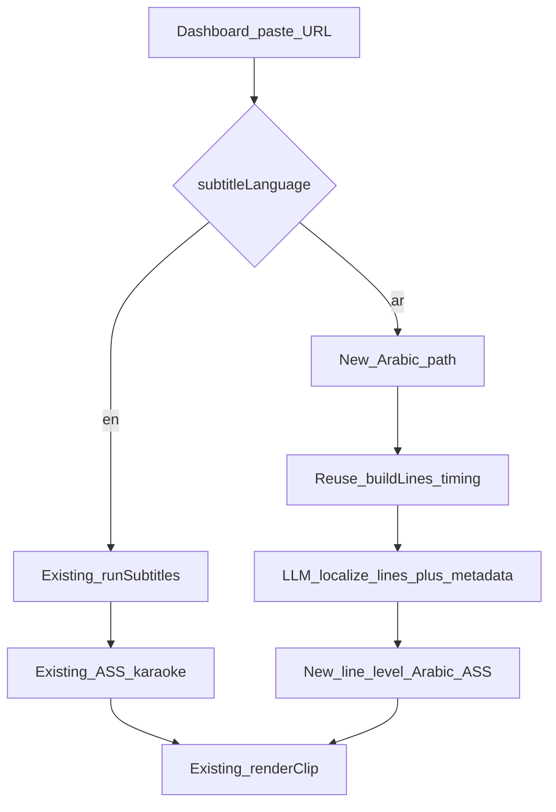

# Arabic Subtitle Path (isolated from English)

## Commitment / safety

- **Do not push to GitHub** unless you explicitly ask.
- **Do not modify** the existing English karaoke path (`wordPillMode`, Latin metrics, `uppercase` themes, current ASS layering) except for a single branch point that selects English vs Arabic.
- Ship Arabic as a **parallel code path** so English projects keep today’s behavior byte-for-byte.

## Your suggestion (accepted)

Choosing language at paste time + a separate Arabic subtitle builder is the safest design:

- **English** → current `runSubtitles` → current `buildAss` → current render (unchanged).
- **Arabic** → new localize + Arabic ASS builder → same ffmpeg burn entry, different `.ass` file.

One language **per project** (not dual-language export in v1). Simpler storage, simpler UI, no dual-render cost.




## Product scope (locked)


| In v1                                          | Out of v1                         |
| ---------------------------------------------- | --------------------------------- |
| English (or other) source → Arabic Shorts      | Arabic UI / RTL chrome            |
| Arabic burned subtitles                        | Per-word karaoke pills for Arabic |
| Arabic titles, hooks, summaries, hashtags      | Dual EN+AR export in one project  |
| Dialect: **natural MSA Shorts tone** (default) | Full app i18n                     |


Dialect can become a setting later; v1 prompt locks MSA + natural (not literal) Shorts Arabic.

## User flow

1. Dashboard (`[src/app/page.tsx](src/app/page.tsx)`): next to framing style, add **Subtitle language**: `English` | `Arabic`.
2. Prefill from new general setting `defaultSubtitleLanguage` (same pattern as `defaultFramingStyle`).
3. `POST /api/projects` accepts `subtitleLanguage: "en" | "ar"` and stores it in `settingsJson` alongside `framingStyle`.
4. Queue / project detail show a small badge: `EN` or `AR` so the choice is visible.

## Data model (no migration required)

Extend project `settingsJson` only:

```json
{
  "framingStyle": "blur|crop|auto-crop",
  "subtitleLanguage": "en|ar"
}
```

General settings (`[src/lib/settings/store.ts](src/lib/settings/store.ts)`):

- `defaultSubtitleLanguage: "en" | "ar"` (default `"en"`)

When `subtitleLanguage === "ar"`, after localization **overwrite** clip `title` / `hook` / `summary` / `hashtagsJson` with Arabic (one language per project). Transcript words stay source-language (needed for timing).

## Pipeline design

### Keep untouched when `en`

- `[src/lib/pipeline/subtitles.ts](src/lib/pipeline/subtitles.ts)`
- `[src/lib/subtitles/ass.ts](src/lib/subtitles/ass.ts)`
- `[src/lib/subtitles/metrics.ts](src/lib/subtitles/metrics.ts)`
- `[src/lib/subtitles/layout.ts](src/lib/subtitles/layout.ts)`
- Theme karaoke behavior

### Arabic branch (new)

Insert work **after** analyze (clips exist) and **instead of** English `runSubtitles` when language is `ar`:

1. **Timing from English words (reuse)**
  Call existing `buildLines(words, …)` so cue start/end stay correct. Do **not** try word-aligned Arabic karaoke.
2. **LLM localize (dedicated step)** — new module e.g. `[src/lib/llm/localize-ar.ts](src/lib/llm/localize-ar.ts)`
  Input: per clip `{ title, hook, summary, hashtags, lines: [{ startMs, endMs, text }] }`  
   Output (zod): same shape with natural Arabic MSA Shorts copy.  
   Rules in prompt: not literal; punchy; subtitle-safe line length; keep line count; do not invent meaning; preserve timing indices 1:1.
3. **Persist Arabic metadata** on `clips` rows.
4. **Write Arabic SRT + ASS** — new `[src/lib/subtitles/ass-ar.ts](src/lib/subtitles/ass-ar.ts)` (or `buildAssArabic`)
  - Line-level Dialogue only (one event per cue)  
  - **No** word pills, **no** pop karaoke, **no** `uppercase`  
  - `\an5` center (or bottom-center) with existing PlayRes 1080×1920  
  - Explicit Arabic-capable font (see Fonts)  
  - Optional ASS RTL hint (`\an` + ensure libass gets Unicode; avoid LTR-only joins)
5. **Render**
  Same `[renderClip](src/lib/video/render.ts)`; it already burns whatever `.ass` path exists. Pass `fontsdir` only on Arabic burns so English stays identical.

Branch point in `[runSubtitles](src/lib/pipeline/subtitles.ts)` (or thin wrapper):

```ts
if (subtitleLanguage === "ar") return runArabicSubtitles(ctx);
// existing English path unchanged below
```

## Fonts (critical for burn-in)

English path does not pass `fontsdir`. Arabic must:

- Ship or document a font under e.g. `assets/fonts/NotoSansArabic-Bold.ttf` (or use a known Windows face like `Segoe UI` / `Tahoma` if verified on your machine).
- Prefer **bundled Noto Sans Arabic** so renders are reproducible.
- FFmpeg filter: `subtitles=file.ass:fontsdir=...` **only** for Arabic.

Preview route for Arabic themes/samples must use the same font path.

## Themes

- Do **not** force English viral/pill themes onto Arabic.
- v1: one built-in **Arabic Safe** style (clean, no pills, no uppercase, larger size, higher `maxChars` for Arabic visual density).
- If project’s theme is pill-based and language is `ar`, **ignore pills** and use the Arabic-safe style (log a note). Keeps English themes untouched.

## Settings / API touchpoints


| Area                                                                    | Change                                                   |
| ----------------------------------------------------------------------- | -------------------------------------------------------- |
| `[GeneralSettingsSchema](src/lib/settings/store.ts)`                    | `defaultSubtitleLanguage`                                |
| `[general-settings-form.tsx](src/components/general-settings-form.tsx)` | Language default control                                 |
| `[page.tsx](src/app/page.tsx)`                                          | Language select + POST field                             |
| `[api/projects/route.ts](src/app/api/projects/route.ts)`                | Accept + persist `subtitleLanguage`                      |
| `[analyze.ts](src/lib/pipeline/analyze.ts)`                             | No step order change; subtitles step branches internally |
| Exports                                                                 | Unchanged paths (`subs/clip_NN.srt                       |


## What we deliberately skip (protect the project)

1. **RTL app shell** — English UI stays LTR.
2. **Arabic per-word pills** — needs Arabic metrics + BiDi; high break risk. Revisit only after line-level path is proven.
3. **Changing Latin `metrics.ts` tables** — leave Latin calibration alone; Arabic ASS won’t use those width estimates for pills.
4. **Google/DeepL** — LLM only for natural localization (matches your quality bar).
5. **Git push** — never unless you ask.

## Phased rollout (implementation order)

1. **Settings + create UI** — `subtitleLanguage` end-to-end (still English-only behavior if `ar` not implemented yet, or gate with clear error).
2. **LLM localize module** — unit-testable with fixture JSON; no render yet.
3. **Arabic ASS/SRT writer + font** — preview PNG via existing theme preview pattern.
4. **Wire `runArabicSubtitles`** + metadata overwrite + render `fontsdir`.
5. **Manual smoke test** — same URL twice (EN vs AR); confirm EN output unchanged; AR has readable Arabic burn-in and Arabic titles on cards.

## Success criteria

- English project after this work matches pre-change renders (visually / ASS structure).
- Arabic project produces readable burned Arabic captions (not mojibake, not boxes).
- Titles/hooks/hashtags on Arabic projects are natural Shorts Arabic, not literal calques.
- Choosing EN vs AR is obvious at create time and visible on the project.
- Nothing pushed to GitHub as part of this work.

